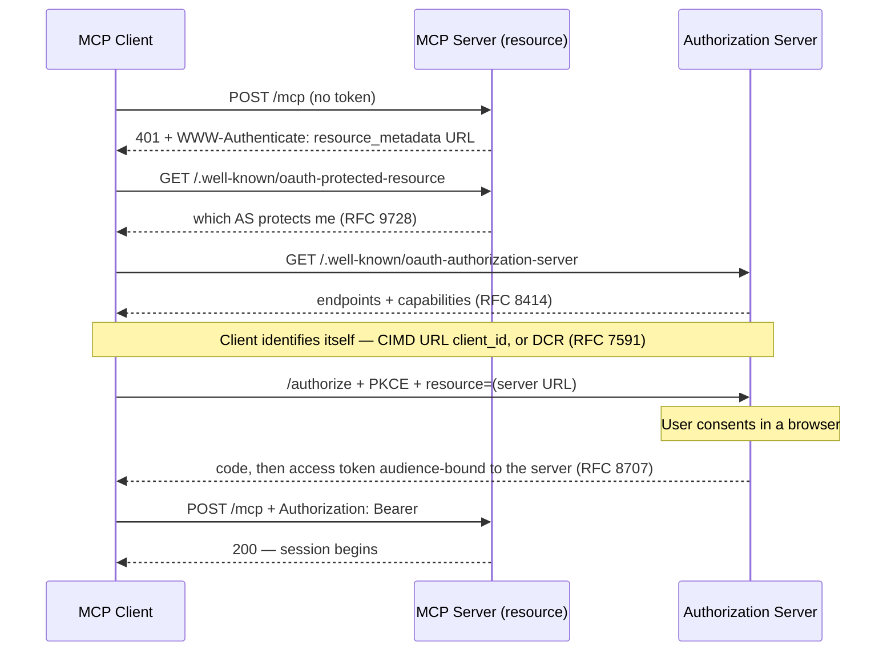

<!-- Generated from src/lib/labs/content/labs/mcp-101.mdx in Zenable-io/next-gen-governance
     by services/ui_frontend/scripts/export-lab-readme.js. Do not edit by hand. -->

# MCP 101: Build a Server, Swap the Clients

Learn what an MCP host, client, and server actually are, then prove it — write an MVP server with FastMCP, test it with a scripted client, move it into a container, and connect goose to it without changing a line of server code.

**[▶ Take this lab on the Zenable Learning Hub](https://www.zenable.app/learn?lab=mcp-101&utm_source=github&utm_medium=labs_repo&utm_campaign=mcp-101_readme)** — fully hosted sandbox environment, progress tracking, and a full-featured lab workspace.

**Duration** 90 minutes · **Difficulty** Beginner

**Topics** `MCP` · `FastMCP` · `stdio` · `Streamable HTTP` · `OAuth` · `goose` · `Docker` · `Python` · `Open Source`

**Prerequisites**

- Python 3.11+ and uv
- Docker
- An LLM provider API key (any goose-supported provider) for the final section only — everything before it needs none

---

## Host, client, server

_~10 min · Lecture_

MCP (Model Context Protocol) is how an AI application reaches tools and data it does not contain. Three words carry the whole architecture, and people conflate them constantly:

- The **host** is the application the human actually runs — goose, Claude Desktop, your IDE. It owns the model, the conversation, and the decision to call a tool at all.
- The **client** is a component *inside* the host. The host creates **one client per server connection**, and that client talks to exactly one server for its whole life. You will almost never write one by hand — it is plumbing the host provides.
- The **server** is the small program that declares capabilities — **tools** (functions the model may call), **resources** (data the host may read), and **prompts** (templates the user may invoke) — and answers JSON-RPC 2.0 requests. This is the thing you write today.

The slides have the one-picture version of this. The load-bearing fact: the client–server relationship is 1:1. A host talking to five servers is running five clients. That is why "which client am I configuring?" is usually the wrong question — you configure the *host*, and it makes clients.

Everything on the wire is JSON-RPC 2.0: `initialize` handshake, then requests like `tools/list` and `tools/call`. You will see every one of these messages today with your own eyes.

## Three transports, one survivor

_~10 min · Lecture_

The protocol is transport-agnostic; the messages are identical everywhere. Three transports exist, and only two are current:

**stdio.** The host spawns the server as a subprocess and speaks newline-delimited JSON-RPC over stdin/stdout. No network, no port, no auth question — the OS process boundary is the security boundary. This is the default for local tools, and it has one famous foot-gun: anything your server prints to **stdout** corrupts the protocol stream. Log to stderr, always.

**HTTP+SSE (deprecated).** The first remote transport: a permanently open `GET /sse` event stream down, plus a separate `POST /messages` channel up. The always-open stream fought load balancers, serverless, and resumability, and the protocol deprecated it in the 2025-03-26 revision. You need to *recognize* it — old blog posts and configs are full of it — but never build on it.

**Streamable HTTP.** The current remote transport. One endpoint (conventionally `/mcp/`); a request gets back either a plain JSON response or, when the server wants to stream progress for that one call, an SSE stream scoped to the request. Stateless deployments work, load balancers work. This is what your container will serve.

The practical takeaway that this whole lab demonstrates: **transport is a launch-time decision, not a code decision.** Your server file will never mention either one.

## OAuth in one diagram

_~5 min · Lecture_

On localhost there is no auth story — the process boundary is the story. The moment an MCP server is remote and multi-user, it is an OAuth 2.1 **resource server**, and the client has to *earn* a Bearer token before the session starts. The negotiation is a chain of discovery hops, none hardcoded:



Read it once, keep two facts: the client starts by getting refused (the 401 *is* the front door, not an error), and the token that comes back is bound to one server — a token minted for server A is garbage at server B by design.

That is all the OAuth this lab needs. The full flow — enterprise IdPs, ID-JAG, cross-app access, and breaking the security properties on purpose — is its own workshop: [MCP Enterprise Authorization 101](https://www.zenable.app/learn?lab=mcp-authorization-101&utm_source=github&utm_medium=labs_repo&utm_campaign=mcp-101_readme).

## Build the MVP server with FastMCP

_~15 min · Hands-on_

[FastMCP](https://github.com/jlowin/fastmcp) is the Pythonic way to write a server: a decorator turns a typed function into an MCP tool, and the type hints become the tool's JSON schema — the thing the model reads to know how to call you.

Clone the lab rig and install the one dependency:

```bash
git clone https://github.com/Zenable-io/labs.git ~/zenable-labs 2>/dev/null \
  || git -C ~/zenable-labs pull --ff-only
cd ~/zenable-labs/labs/mcp-101
uv sync
uv run fastmcp version
```

Open `server.py`. This is the whole server — yes, all of it:

```python
from fastmcp import FastMCP

mcp = FastMCP("mcp-101")


@mcp.tool
def add(a: int, b: int) -> int:
    """Add two integers."""
    return a + b


@mcp.tool
def shout(text: str) -> str:
    """Uppercase a string and add urgency."""
    return text.upper() + "!"


if __name__ == "__main__":
    mcp.run()
```

`mcp.run()` with no arguments speaks **stdio** — it sits there waiting for a host to feed it JSON-RPC on stdin. Prove that it is a protocol speaker, not a normal script, by playing host yourself for one message:

```bash
printf '%s\n' \
  '{"jsonrpc":"2.0","id":1,"method":"initialize","params":{"protocolVersion":"2025-06-18","capabilities":{},"clientInfo":{"name":"you","version":"0"}}}' \
  | timeout 5 uv run python server.py 2>/dev/null | head -1
```

You just performed the MCP handshake by hand: one `initialize` request in, one JSON-RPC response out, carrying the server's name and capabilities. Every host you will ever configure does exactly this first.

> [!TIP]
> **Pro tip — the docstrings and type hints are not decoration.** FastMCP compiles them into the tool schema the model sees. A tool named `add` with parameters `a` and `b` and no description forces the model to guess; a one-line docstring is the difference between a tool that gets called correctly and one that gets called with `{"text": "2+3"}`. Treat tool signatures as API design, because that is literally what they are.

## Test it with a FastMCP client

_~12 min · Hands-on_

A model is a terrible first test harness — it is nondeterministic and it hides the wire. FastMCP ships a client, and the rig's `client.py` scripts the exact calls a host would make:

```python
import asyncio
import sys

from fastmcp import Client

target = sys.argv[1] if len(sys.argv) > 1 else "server.py"


async def main() -> None:
    async with Client(target) as client:
        tools = await client.list_tools()
        print("tools:", sorted(t.name for t in tools))

        result = await client.call_tool("add", {"a": 2, "b": 3})
        print("add(2, 3) =", result.data)

        result = await client.call_tool("shout", {"text": "mcp works"})
        print("shout =", result.data)


asyncio.run(main())
```

Run it:

```bash
uv run python client.py
```

Expected output:

```console
tools: ['add', 'shout']
add(2, 3) = 5
shout = MCP WORKS!
```

Two things worth noticing. First, `Client("server.py")` **inferred the transport from the target**: a Python file path means "spawn it as a subprocess and speak stdio" — your test just launched and killed a real server process. Second, that `sys.argv[1]` is deliberate: the same script will retest the containerized server in the next section by passing a URL instead of a path. One client, both transports.

## Move the server into a container, retest

_~18 min · Hands-on_

Same `server.py`, no edits — the rig's `Dockerfile` just launches it differently, with the FastMCP CLI choosing Streamable HTTP at the door:

```dockerfile
FROM python:3.13-slim
RUN pip install --no-cache-dir 'fastmcp>=2.13,<3'
WORKDIR /app
COPY server.py .
EXPOSE 8000
CMD ["fastmcp", "run", "server.py", "--transport", "http", "--host", "0.0.0.0", "--port", "8000"]
```

Build and run it:

```bash
docker build -t mcp-101 .
docker run -d --rm --name mcp-101 -p 8000:8000 mcp-101
sleep 2
docker logs mcp-101
```

The logs should show uvicorn listening on `0.0.0.0:8000`. Now the retest — the same client script, with the file path swapped for a URL:

```bash
uv run python client.py http://127.0.0.1:8000/mcp/
```

Same three lines of output. Sit with what just happened: the server code did not change, the client code did not change, and yet the deployment went from "subprocess with two pipes" to "network service in a container." The transport really was a launch flag.

> [!TIP]
> **Pro tip — `/mcp/` is convention, not magic.** FastMCP serves Streamable HTTP at `/mcp/` by default, and most clients expect a full URL including the path. When some host "can't connect" to a server that is demonstrably up, the missing `/mcp/` suffix is the first thing to check — it is the MCP equivalent of forgetting `:443` isn't the problem but `https://` is.

If you are curious what refused-by-default looks like, probe the endpoint with plain curl and no MCP handshake:

```bash
curl -s -o /dev/null -w '%{http_code}\n' http://127.0.0.1:8000/mcp/
```

The non-200 you get back is the server telling you it speaks MCP, not a browser page. In the OAuth diagram earlier, this same "wrong door" moment is where the 401 + `WWW-Authenticate` chain would begin.

## Swap the client for goose, retest

_~15 min · Hands-on_

Your script proved the server is correct. Now prove it is *interoperable* by pointing a real host at it — [goose](https://github.com/block/goose), Block's open-source agent. goose has never heard of your server; all they share is the protocol.

Install goose (pinned so your output matches the lab):

```bash
if ! command -v bzip2 >/dev/null 2>&1; then
  sudo apt-get update -qq && sudo apt-get install -y -qq bzip2
fi
curl -fsSL https://github.com/block/goose/releases/download/stable/download_cli.sh | CONFIGURE=false GOOSE_VERSION=v1.46.0 bash
export PATH="$HOME/.local/bin:$PATH"
goose --version
```

This is where a model finally enters the story: goose is a full host, so it needs an LLM provider to drive tool calls. Configure one (any provider goose supports; `goose configure` walks you through it), then start a session with your container attached as a Streamable HTTP extension:

```bash
export PATH="$HOME/.local/bin:$PATH"
goose session --with-streamable-http-extension "http://127.0.0.1:8000/mcp/"
```

In the session, ask something that forces a tool call rather than mental arithmetic:

```
Use the add tool to compute 20260825 + 101, then shout the phrase "protocols over plugins".
```

Watch the transcript: goose lists your tools during its handshake, the model picks `add`, and the result comes back through the same `tools/call` your script issued. When it responds with `20260926` and `PROTOCOLS OVER PLUGINS!`, every layer of the stack — your code, the container, the transport, the host — just shook hands in public.

> [!TIP]
> **Pro tip — no provider key? You still proved the claim.** The interop demonstration is the handshake, and you already ran it twice without any model: once by hand with `printf`, once scripted with the FastMCP client. The goose session adds the last layer — a model *choosing* to call your tool — but "goose connected and listed `add` and `shout`" is visible in the session startup before any tokens are spent.

Clean up when you are done:

```bash
docker stop mcp-101
```

## What to take away

_~5 min · Lecture_

- **Host, client, server are roles, not products.** goose is a host; it spawned one client for your one server. Configure hosts, write servers, let clients be plumbing.
- **Transport is a launch flag.** One `server.py` ran as a stdio subprocess and as a containerized Streamable HTTP service, unedited. SSE exists only in old documentation.
- **The refusal is the front door.** Remote, multi-user MCP means OAuth: a 401 that names its authorization server, discovery all the way down, and a token bound to one audience. When you are ready for that flow for real, [MCP Enterprise Authorization 101](https://www.zenable.app/learn?lab=mcp-authorization-101&utm_source=github&utm_medium=labs_repo&utm_campaign=mcp-101_readme) is the next lab.
- **Interop is the product.** You changed clients without touching the server, and containerized the server without touching the client. That symmetry is the entire reason MCP exists.

---

_Written for the [Zenable Learning Hub](https://www.zenable.app/learn?lab=mcp-101&utm_source=github&utm_medium=labs_repo&utm_campaign=mcp-101_readme); published here because the rig lives here. [Browse every lab](https://www.zenable.app/learn?utm_source=github&utm_medium=labs_repo&utm_campaign=mcp-101_readme), or open an issue on this repo if something is broken._
