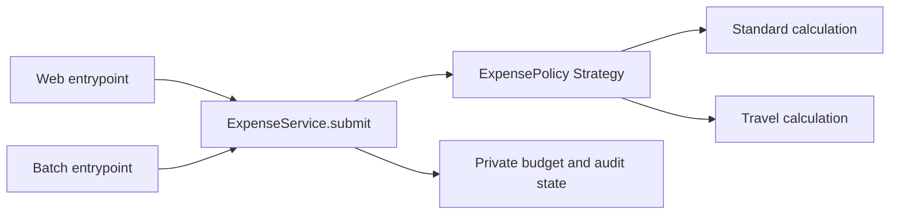

<!-- Copyright (c) 2026 Zenable, Inc. -->
<!-- Generated by a scheduled sync. Do not edit by hand. -->

# Refactoring for the Next Change

Refactor an expense service so future developers and coding agents can extend it without bypassing tenant isolation, authorisation, or accounting rules. Practise the same design in Python, Go, or Java.

**[▶ Take this lab on the Zenable Learning Hub](https://www.zenable.app/learn?lab=refactoring-for-change&utm_source=github&utm_medium=labs_repo&utm_campaign=refactoring-for-change_readme)** — fully hosted sandbox environment, progress tracking, and a full-featured lab workspace.

**Duration** 75 minutes · **Difficulty** Intermediate

**Topics** `Software Development` · `Verification`

**Prerequisites**

- Comfortable editing and testing Python, Go, or Java
- A Learning Hub sandbox, or Docker and Git locally
- A coding agent is optional; no API key is required

---

## Design for the next change

_~3 min · Hands-on_

Has a small change ever broken a rule that lived somewhere else in the codebase?

In this lab, we get hands-on with an expense service. Three individually reasonable requests lead to an unauthorised debit. We'll find the missing context, repair the behaviour, and reshape the code before making another change.

The working assumption is that a future developer or coding agent will see only part of the system. We'll make the required path easy to discover and difficult to bypass accidentally, then check it through executable contracts.

Unmesh Joshi's [What Is Code?](https://martinfowler.com/articles/what-is-code.html), published on Martin Fowler's site, describes code as shared vocabulary and context for LLMs. We'll explore that argument through a design exercise. A pattern alone can't guarantee correct AI output.

Our agenda is to reproduce the third-change failure, name the rules, refactor around two useful patterns, measure complexity, and review a fourth change with limited context. Choose Python, Go or Java at the top. Follow one language throughout; changing language means repeating its exercises.

## Getting started

_~7 min · Hands-on_

Let's clone the rig into a fresh working directory and build its toolchain image. A Learning Hub sandbox already supplies Git and Docker. Locally, start Docker first. The image contains all three languages; no coding-agent subscription or API key is needed.

```bash
git clone https://github.com/Zenable-io/labs.git ~/zenable-labs || git -C ~/zenable-labs pull --ff-only
cd ~/zenable-labs/labs/refactoring-for-change
./lab build
```

The build downloads pinned toolchains and locked Python dependencies. Later commands run without network access. Source is mounted read-only inside the container, so make edits in your usual editor on the host. The `--network=host` build option supports the sandbox's IPv6-only egress.

The rig has two public worked examples, `history` and `design`, and a shared set of behaviour scenarios. We'll change `history` ourselves. `design` is the example we inspect during the discussion. The final extension has no supplied implementation.

Amounts are integer cents. Two synthetic tenants have an account called `shared`: `alpha` starts with 10,000 cents and `beta` with 20,000. Every command starts a new process and resets that fixture.

The CLI supplies an authenticated principal for testing. In a real application, verified identity supplies the tenant and role. Copying those fields from a request body would already defeat authorisation. Both balances in the output are test diagnostics, never a tenant-facing API.

## Give the design a vocabulary

_~5 min · Hands-on_

An **invariant** is a condition that every supported change must preserve: a refusal changes no balance, for example. An **entrypoint** starts an operation, such as a web request or batch import. A **Strategy** makes a varying algorithm replaceable behind a small contract.

A **Facade** gives callers a simple interface to a subsystem. Our submission service plays that role. More specifically, it follows Fowler's [Service Layer](https://martinfowler.com/eaaCatalog/serviceLayer.html): it owns the application operation and coordinates its rules. These terms describe responsibilities we can inspect in code.

The Gang of Four are Erich Gamma, Richard Helm, Ralph Johnson and John Vlissides. Their [Design Patterns: Elements of Reusable Object-Oriented Software](https://www.pearson.com/en-us/subject-catalog/p/design-patterns-elements-of-reusable-object-oriented-software/P200000009480/9780201633610) supplies the Strategy and Facade vocabulary used here.

**Refactoring** preserves observable behaviour while changing internal structure. Correcting an unauthorised payment changes behaviour and is a bug fix. We'll keep those steps distinct, following [Fowler's definition](https://martinfowler.com/bliki/DefinitionOfRefactoring.html), so a reviewer can see which expectations intentionally change.

Before opening the code, write down which responsibilities should belong to transport code, reimbursement policy, and submission integrity. We'll revisit that split after the failure.

## Three reasonable changes

_~8 min · Hands-on_

Imagine three short tickets, handled weeks apart by different people or fresh agent sessions:

1. Add web expense submission. Check the caller and tenant, apply the standard policy, debit the budget, and record an audit event.
2. Add travel expenses. Reimburse 80% of the request, rounded down to whole cents. The web path gains another policy branch.
3. Add a batch importer. The existing web handler seems tied to its transport, so the new path reuses the account map and subtracts the requested amount directly.

That third implementation can pass a test saying "a valid row reduces a balance". The omitted rules are outside the slice of code its author copied. Let's run a fixture that submits two valid web expenses, then a batch request from an `alpha` viewer against `beta`.

### Python

```bash
./lab run python history three-changes --check
```

### Go

```bash
./lab run go history three-changes --check
```

### Java

```bash
./lab run java history three-changes --check
```

The command deliberately exits with status 1. The first two submissions leave `alpha` with 8,200 cents. The importer then takes 2,000 cents from `beta` despite the caller's role and tenant. Audit history still contains only the two web events.

Let's trace the historical implementation. Circle every piece of context a new caller must remember. Pay particular attention to where the mutable account state can be reached.

### Python

Open `languages/python/src/expenses/history.py`.

```python
# Copyright (c) 2026 Zenable, Inc.
from expenses.domain import Expense, Principal, Refused, Snapshot


class HistoricalExpenses:
    """Deliberately unsafe historical example, used only with synthetic accounts."""

    def __init__(self) -> None:
        self.accounts = {("alpha", "shared"): 10_000, ("beta", "shared"): 20_000}
        self.events: list[Expense] = []

    def web(self, principal: Principal, expense: Expense) -> str:
        if principal.role != "approver" or principal.tenant != expense.tenant:
            raise Refused("forbidden")
        payable = expense.cents
        if expense.policy == "standard":
            if expense.cents > 5_000:
                raise Refused("policy_limit")
        elif expense.policy == "travel":
            if expense.cents > 10_000:
                raise Refused("policy_limit")
            payable = expense.cents * 4 // 5
        else:
            raise Refused("unknown_policy")
        key = (expense.tenant, expense.account)
        if key not in self.accounts:
            raise Refused("not_found")
        if payable > self.accounts[key]:
            raise Refused("insufficient_budget")
        self.accounts[key] -= payable
        self.events.append(expense)
        return "accepted"

    def batch(self, principal: Principal, expense: Expense) -> str:
        key = (expense.tenant, expense.account)
        if key not in self.accounts:
            raise Refused("not_found")
        self.accounts[key] -= expense.cents
        return "accepted"

    def snapshot(self) -> Snapshot:
        return Snapshot(
            alpha=self.accounts[("alpha", "shared")],
            beta=self.accounts[("beta", "shared")],
            events=len(self.events),
        )
```

### Go

Open `languages/go/internal/expenses/history.go`.

```go
// Copyright (c) 2026 Zenable, Inc.
package expenses

import "errors"

// HistoricalExpenses is deliberately unsafe and only uses synthetic accounts.
type HistoricalExpenses struct {
	accounts map[accountKey]int
	events   []Expense
}

func NewHistory() *HistoricalExpenses {
	return &HistoricalExpenses{accounts: map[accountKey]int{
		{"alpha", "shared"}: 10000, {"beta", "shared"}: 20000,
	}}
}

func (history *HistoricalExpenses) Web(principal Principal, expense Expense) (string, error) {
	if principal.Role != "approver" || principal.Tenant != expense.Tenant {
		return "", errors.New("forbidden")
	}
	payable := expense.Cents
	if expense.Policy == "standard" {
		if expense.Cents > 5000 {
			return "", errors.New("policy_limit")
		}
	} else if expense.Policy == "travel" {
		if expense.Cents > 10000 {
			return "", errors.New("policy_limit")
		}
		payable = expense.Cents * 4 / 5
	} else {
		return "", errors.New("unknown_policy")
	}
	key := accountKey{expense.Tenant, expense.Account}
	balance, found := history.accounts[key]
	if !found {
		return "", errors.New("not_found")
	}
	if payable > balance {
		return "", errors.New("insufficient_budget")
	}
	history.accounts[key] -= payable
	history.events = append(history.events, expense)
	return "accepted", nil
}

func (history *HistoricalExpenses) Batch(principal Principal, expense Expense) (string, error) {
	key := accountKey{expense.Tenant, expense.Account}
	if _, found := history.accounts[key]; !found {
		return "", errors.New("not_found")
	}
	history.accounts[key] -= expense.Cents
	return "accepted", nil
}

func (history *HistoricalExpenses) Snapshot() Snapshot {
	return Snapshot{history.accounts[accountKey{"alpha", "shared"}],
		history.accounts[accountKey{"beta", "shared"}], len(history.events)}
}
```

### Java

Open `languages/java/src/main/java/lab/expenses/HistoricalExpenses.java`.

```java
// Copyright (c) 2026 Zenable, Inc.
package lab.expenses;

import java.util.ArrayList;
import java.util.HashMap;
import java.util.List;
import java.util.Map;

/** Deliberately unsafe historical example, restricted to synthetic accounts. */
public final class HistoricalExpenses {
    private final Map<String, Integer> accounts = new HashMap<>();
    private final List<Expense> events = new ArrayList<>();

    public HistoricalExpenses() {
        accounts.put("alpha/shared", 10_000);
        accounts.put("beta/shared", 20_000);
    }

    public String web(Principal principal, Expense expense) {
        if (!principal.role.equals("approver") || !principal.tenant.equals(expense.tenant)) {
            throw new Refused("forbidden");
        }
        int payable = expense.cents;
        if (expense.policy.equals("standard")) {
            if (expense.cents > 5_000) throw new Refused("policy_limit");
        } else if (expense.policy.equals("travel")) {
            if (expense.cents > 10_000) throw new Refused("policy_limit");
            payable = expense.cents * 4 / 5;
        } else {
            throw new Refused("unknown_policy");
        }
        String key = expense.tenant + "/" + expense.account;
        Integer balance = accounts.get(key);
        if (balance == null) throw new Refused("not_found");
        if (payable > balance) throw new Refused("insufficient_budget");
        accounts.put(key, balance - payable);
        events.add(expense);
        return "accepted";
    }

    public String batch(Principal principal, Expense expense) {
        String key = expense.tenant + "/" + expense.account;
        Integer balance = accounts.get(key);
        if (balance == null) throw new Refused("not_found");
        accounts.put(key, balance - expense.cents);
        return "accepted";
    }

    public Snapshot snapshot() {
        return new Snapshot(accounts.get("alpha/shared"), accounts.get("beta/shared"), events.size());
    }
}
```

Question: would extracting `check_permissions`, `apply_policy` and `record_audit` into public helpers stop the third change from missing one?

<details>
<summary>Discuss after tracing both paths</summary>

The caller would still have to remember the whole sequence. Those helpers might improve naming, but independently callable checks don't make the operation mandatory. The missing responsibility is ownership of the complete submission.

</details>

## Turn missing context into a contract

_~8 min · Hands-on_

Open `scenarios.json` and `tests/test_contract.py`. All languages run the same cases against their public entrypoints. Each scenario starts fresh; requests inside one scenario share state.

Write these requirements in your own words before editing implementation: callers must be authorised for the tenant; policies apply to every entrypoint; budget and audit changes belong together; a retry mustn't pay twice.

The supplied cases include the same account identifier in two tenants, a viewer, a policy limit, an exhausted budget, a changed retry payload, a different retry actor, and revoked permission on retry. Inspect what each refusal checks about state, not just its error string.

Add a scenario that reuses a request identifier with a different policy. It should report `idempotency_conflict` and preserve the first payment and audit count. Use the existing changed-amount scenario as the data-format example. Keep the expected outcome independent of how the service stores state.

Before editing, try a web submission followed by a batch retry of the same request:

### Python

```bash
./lab run python history retry --check
```

### Go

```bash
./lab run go history retry --check
```

### Java

```bash
./lab run java history retry --check
```

The balance changes twice. Retrying needs an explicit rule as well.

Now repair the immediate batch bug: have the batch entrypoint use the complete web operation instead of mutating the account map. Run the three-change scenario again after your edit:

### Python

```bash
./lab run python history three-changes --check
```

### Go

```bash
./lab run go history three-changes --check
```

### Java

```bash
./lab run java history three-changes --check
```

That scenario should pass. A retry still debits twice, so add that behaviour with its tests before treating the remaining work as behaviour-preserving refactoring.

Google's [Code Coverage Best Practices](https://testing.googleblog.com/2020/08/code-coverage-best-practices.html) stresses the limits of coverage as a quality signal. Running every existing line wouldn't have invented the missing tenant or retry requirement. Tests need assertions about the business effect.

## Refactor around the operation

_~17 min · Hands-on_

Let's move submission integrity into one owner. Keep transport concerns outside it. Reimbursement algorithms can vary, so give them the small Strategy interface shown below.

### Python

Open `languages/python/src/expenses/policies.py`.

```python
# Copyright (c) 2026 Zenable, Inc.
from typing import Protocol

from expenses.domain import Expense, Refused


class ExpensePolicy(Protocol):
    def reimburse(self, expense: Expense) -> int: ...


class StandardPolicy:
    def reimburse(self, expense: Expense) -> int:
        if expense.cents > 5_000:
            raise Refused("policy_limit")
        return expense.cents


class TravelPolicy:
    def reimburse(self, expense: Expense) -> int:
        if expense.cents > 10_000:
            raise Refused("policy_limit")
        return expense.cents * 4 // 5
```

### Go

Open `languages/go/internal/expenses/policies.go`.

```go
// Copyright (c) 2026 Zenable, Inc.
package expenses

import "errors"

type ExpensePolicy interface {
	Reimburse(Expense) (int, error)
}

type StandardPolicy struct{}

func (StandardPolicy) Reimburse(expense Expense) (int, error) {
	if expense.Cents > 5000 {
		return 0, errors.New("policy_limit")
	}
	return expense.Cents, nil
}

type TravelPolicy struct{}

func (TravelPolicy) Reimburse(expense Expense) (int, error) {
	if expense.Cents > 10000 {
		return 0, errors.New("policy_limit")
	}
	return expense.Cents * 4 / 5, nil
}
```

### Java

Open `languages/java/src/main/java/lab/expenses/ExpensePolicy.java`.

```java
// Copyright (c) 2026 Zenable, Inc.
package lab.expenses;

public interface ExpensePolicy {
    int reimburse(Expense expense);
}
```

```java
// Copyright (c) 2026 Zenable, Inc.
package lab.expenses;

public final class StandardPolicy implements ExpensePolicy {
    @Override
    public int reimburse(Expense expense) {
        if (expense.cents > 5_000) throw new Refused("policy_limit");
        return expense.cents;
    }
}
```

```java
// Copyright (c) 2026 Zenable, Inc.
package lab.expenses;

public final class TravelPolicy implements ExpensePolicy {
    @Override
    public int reimburse(Expense expense) {
        if (expense.cents > 10_000) throw new Refused("policy_limit");
        return expense.cents * 4 / 5;
    }
}
```

All versions have the same responsibilities: standard reimburses the request up to its limit; travel calculates 80% up to its limit. Neither receives identity, account storage or an audit writer.

These algorithms vary. If only a numeric limit varied, a table of limits might be enough. An interface is useful here because it separates calculation from the submission rules that every caller must follow.



Open the service for your chosen language:

### Python

`languages/python/src/expenses/service.py`

Trace the public submission method, the private state, and the point at which the new state becomes visible.

### Go

`languages/go/internal/expenses/service.go`

Trace the public submission method, the private state, and the point at which the new state becomes visible.

### Java

`languages/java/src/main/java/lab/expenses/ExpenseService.java`

Trace the public submission method, the private state, and the point at which the new state becomes visible.

The service checks authorisation before a replay can return. Within the locked operation, it checks for a prior request before evaluating a policy or finding an account. A changed actor or payload conflicts; an identical retry uses the recorded result without recalculating reimbursement.

For a new request, the service uses tenant-qualified account identity, validates the policy result, checks the budget, and publishes the debit and audit entry together. Adapters get one submission operation, so adding a transport doesn't create another place to assemble those rules.

Now refactor your historical implementation into this structure. Keep its public web and batch operations. Move ownership of mutable state into a submission service, extract the reimbursement algorithms, and make both entrypoints delegate. Remove the old direct-write path once both callers use the new owner.

Work in small steps. First get the new retry requirement passing. Then move existing behaviour without changing its assertions. Finally extract the policy algorithms. Run the full contract after each step, including the scenario you added:

### Python

```bash
./lab test python history
```

### Go

```bash
./lab test go history
```

### Java

```bash
./lab test java history
```

If using a coding agent, give it this instruction and review its proposed ownership boundary before accepting edits:

```text
Refactor the historical expense implementation in the selected language.
Read CONTEXT.md and the shared contract tests first. Identify the owner of
submission integrity and the calculation that can vary independently.
Keep both entrypoints. Add the retry behaviour separately, then preserve
the tested behaviour while extracting the design. Remove bypassing writes.
Explain each new abstraction's responsibility and the tests for its contract.
```

The openly discussed design example gives us another implementation of that contract to inspect and run:

### Python

```bash
./lab test python design
```

### Go

```bash
./lab test go design
```

### Java

```bash
./lab test java design
```

Success! The same behaviour can be checked without asserting private helper calls or class layout. Google's [Test Behavior, Not Implementation](https://testing.googleblog.com/2013/08/testing-on-toilet-test-behavior-not.html) explains why tests of public behaviour can survive internal refactoring.

Let's use SOLID as questions during review. Robert C. Martin's [Single Responsibility Principle](https://blog.cleancoder.com/uncle-bob/2014/05/08/SingleReponsibilityPrinciple.html) relates responsibility to reasons for change. A class containing one method can still mix unrelated responsibilities.

| Principle | Question for this refactoring |
|---|---|
| Single responsibility | Can finance change reimbursement without editing submission integrity? |
| Open/closed | Can we add a policy through composition while leaving the invariant sequence intact? |
| Liskov substitution | Does every policy honour the same result and refusal contract? |
| Interface segregation | Does a policy receive only what calculation needs, with no write capability? |
| Dependency inversion | Does the service depend on the policy contract instead of concrete policy choices? |

The extra interface and composition point cost navigation. They earn that cost by containing a real change axis. Go uses interfaces and composition; Python uses a protocol; Java uses an interface. We don't need a matching inheritance hierarchy or a factory framework.

Question: where would we add a read-only audit viewer? Would inheriting from the submission service grant it capabilities it doesn't need?

<details>
<summary>Discuss the capability boundary</summary>

Give the viewer a narrow read contract scoped to its authorised tenant. Reusing a class that also exposes writes makes those capabilities available by inheritance. Composition makes the intended capability visible at the point it is supplied.

</details>

This example uses one process, a lock and in-memory state. Production persistence must preserve the same contract across workers and crashes, using a transaction and uniqueness constraints. External payments need a separate consistency design, such as an outbox with idempotent consumers. A language-level lock doesn't provide distributed exactly-once execution.

## Measure complexity without losing the rule

_~10 min · Hands-on_

Cyclomatic complexity measures independent paths through a control-flow graph. For one connected function, the graph definition is `C = E - N + 2`. The familiar "decisions plus one" is a useful approximation under a tool's counting rules. [NIST's structured-testing publication](https://doi.org/10.6028/NIST.SP.500-235) develops basis-path testing from this measure.

Let's inspect the original and refactored functions with the same pinned [Lizard analyser](https://github.com/terryyin/lizard). It supports all three languages. Its counts are a review aid; language syntax and parser conventions affect them.

### Python

```bash
./lab metrics python
```

### Go

```bash
./lab metrics go
```

### Java

```bash
./lab metrics java
```

Find the historical batch method. It has very little branching, despite the unauthorised debit we observed. Find the service's submission method next. Collecting the required decisions in one place may make that function's score larger while making the operation easier to use correctly.

Alberto Savoia's Google Testing Blog post [This Code is CRAP](https://testing.googleblog.com/2011/02/this-code-is-crap.html) presents the Change Risk Anti-Patterns measure, developed with Bob Evans. The original formula combines method complexity with basis-path test coverage:

```text
CRAP = C² × (1 - coverage / 100)³ + C
```

Our report measures `C` and shows the formula at assumed coverage values. It doesn't collect coverage. The columns are a worksheet, and statement or branch coverage mustn't be silently relabelled as basis-path coverage.

Choose a method with `C = 10` in a hypothetical review. Calculate its score with 0%, 50% and 100% coverage: 110, 22.5 and 10. Now explain which missing requirements could still survive all three scores. The original 30-point threshold is a heuristic, not a security certificate or a universal merge rule.

Make one small guard-clause refactoring in your working copy, rerun its contract tests, and measure again. Google's [Reduce Nesting, Reduce Complexity](https://testing.googleblog.com/2017/06/code-health-reduce-nesting-reduce.html) shows why putting an error beside its check can help readers. Cyclomatic complexity may stay unchanged because the decisions remain.

Record the tool version, function, before/after `C`, tests run, and the coverage assumption separately. Don't average scores across the whole project to hide a difficult function, split methods merely to lower the score, or compare language totals as a ranking.

Question: what does 100% coverage tell us about a tenant check that was never written?

<details>
<summary>Discuss the missing requirement</summary>

There is no line or branch for the tool to count. Coverage describes executed code. The tenant-isolation scenario supplies the missing expectation; design makes every entrypoint share its enforcement.

</details>

## Make a fourth change with limited context

_~12 min · Hands-on_

Let's test whether our structure helps the next person find the extension point. Start a fresh coding-agent conversation, or exchange working copies with a colleague. Ask for this change without retelling the earlier failure:

```text
Add a meals reimbursement policy in the selected language. Accept requests
up to 3,000 cents and reimburse at most 1,500 cents. Keep the existing policies
and both entrypoints. Show where you will extend the design and add tests
before changing code. Use the repository's maintenance guidance.
```

Before sending it, write a short `AGENTS.md` for your working copy. Capture why tenant-qualified identity, authorisation before replay, and atomic budget/audit changes matter. Name the policy extension contract and the test command. Leave out a narrated tour of methods: code already supplies that detail.

If you're already writing `AGENTS.md` or other context files, you've probably seen them become lengthy, complicated and outdated. They need regular maintenance: remove inaccurate details, check instructions against the current code, and evaluate whether they still help the models your team uses today.

Zenable can automate this upkeep for connected repositories, with recurring context evaluation and proposed refinements for review. Visibility into model usage helps teams understand which models are used in which repositories, so they can revisit guidance as that usage changes. Context refinement must be enabled for the repositories being maintained.

Pair those evaluations with deterministic limits. For this small exercise, agree a 200-word budget for the maintenance brief and make exceeding it a review signal. In a larger repository, choose budgets for each context scope. A length check controls growth; it can't decide whether a shorter instruction is accurate or useful.

Read the brief and the code comments together. Remove repeated descriptions of obvious code, obsolete paths and contradictory rules. Keep the reasons behind non-obvious decisions, especially the failure a future edit could reintroduce. If an essential constraint won't fit, review the budget or scope instead of silently truncating it.

When code or models change, repeat representative tasks in fresh sessions and compare contract failures, unnecessary edits and instruction-following. Refine the context from those results. A passing word-count check is only one part of that maintenance loop.

Review the change against the shared contract. Add cases for a valid meal through each entrypoint, the policy limit, a forbidden caller, an exhausted budget, and a retry. Existing cases must remain green. The new policy needs no account-map access and no copy of the authorisation logic.

Run your selected implementation's contract again:

### Python

```bash
./lab test python history
```

### Go

```bash
./lab test go history
```

### Java

```bash
./lab test java history
```

If you extended the worked design instead, use `design` as the last argument. Compare the changed files with the responsibilities we named earlier. A growing list of caller-side helpers or another raw write path is a reason to revisit ownership.

Write a short review: what context did the contributor need, what did the types and API make visible, which unsafe choice remained possible, and which test caught it? One successful agent session is an observation about this exercise, not evidence of a general reduction in AI error rates.

For perspective, [Awni Hannun's X discussion of disposable implementations and maintenance](https://x.com/awnihannun/status/2020520680610296184) argues that expected lifetime changes the value of code quality. That's an opinion worth debating. Our scenario deliberately involves a maintained service with repeated changes and valuable state.

## Congratulations 🎉

_~3 min · Hands-on_

We've reproduced a context-dependent failure, repaired behaviour, and practised a design that gives future changes a defined place to go. Keep your contract scenarios, the before/after measurement, and the maintenance brief together with the patch for review.

Fowler's [Design Stamina Hypothesis](https://martinfowler.com/bliki/DesignStaminaHypothesis.html) argues that investment in design helps sustained delivery. He labels it a hypothesis. In this lab, we assess the concrete cost of our choices: fewer places to assemble critical rules, explicit calculation boundaries, and tests that survive internal changes.

Before calling the refactoring finished, explain who owns each invariant, where a new policy belongs, and how a new entrypoint gets the same safeguards. If that explanation still depends on remembering a sequence of optional helpers, revisit the public operation.

## Cleanup

_~2 min · Hands-on_

Each command removes its container and temporary compilation output. Your source edits remain in the cloned repository. Save your patch and notes before deleting that working copy.

The toolchain image can be removed when you're finished:

```bash
docker image rm zenable-refactoring-lab
```

---

_Written for the [Zenable Learning Hub](https://www.zenable.app/learn?lab=refactoring-for-change&utm_source=github&utm_medium=labs_repo&utm_campaign=refactoring-for-change_readme); published here because the rig lives here. [Browse every lab](https://www.zenable.app/learn?utm_source=github&utm_medium=labs_repo&utm_campaign=refactoring-for-change_readme), or open an issue on this repo if something is broken._
